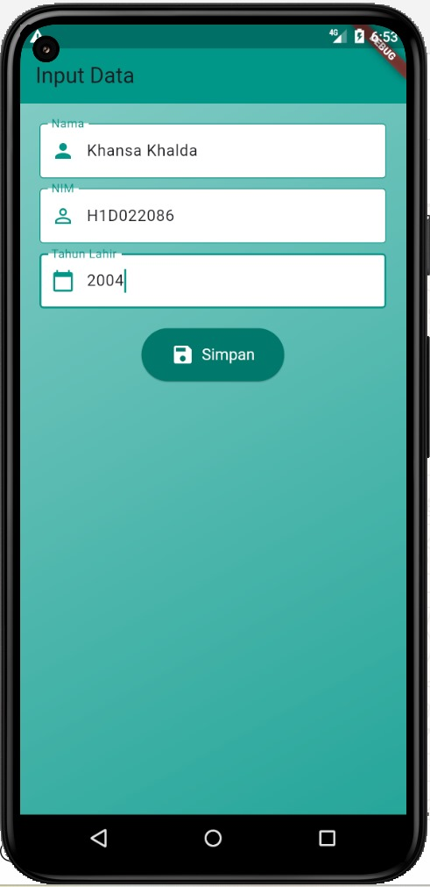
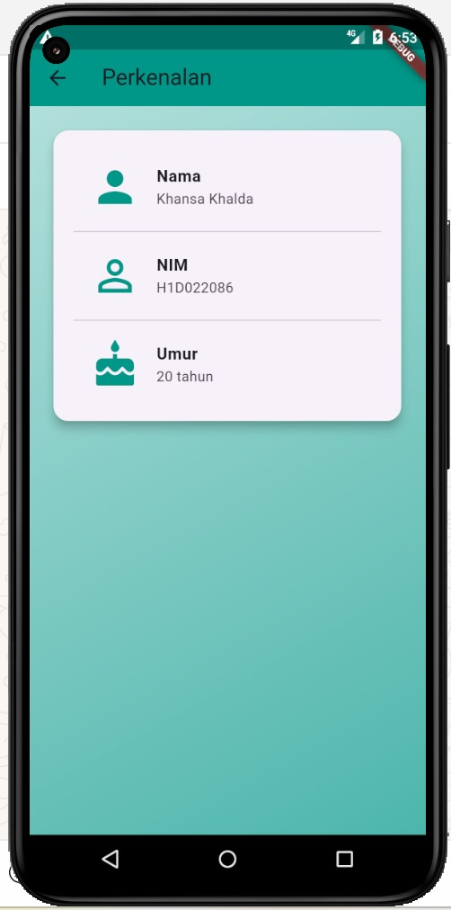
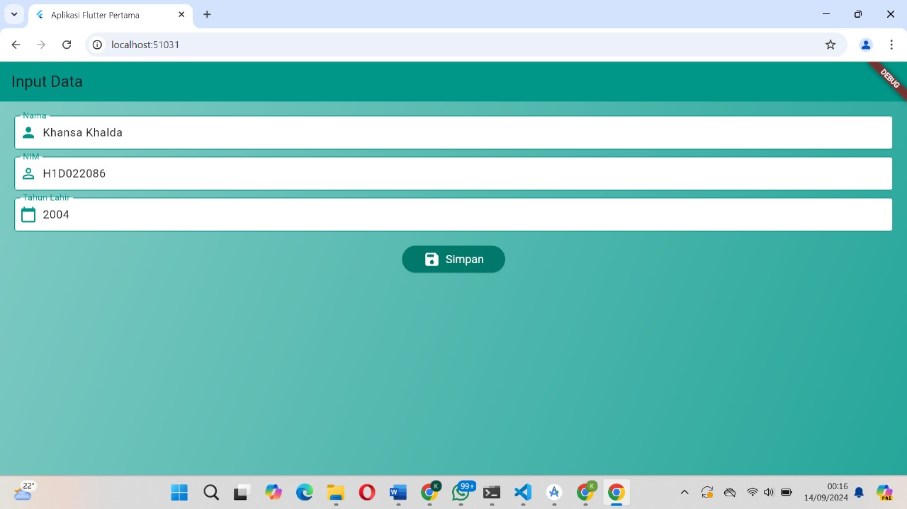
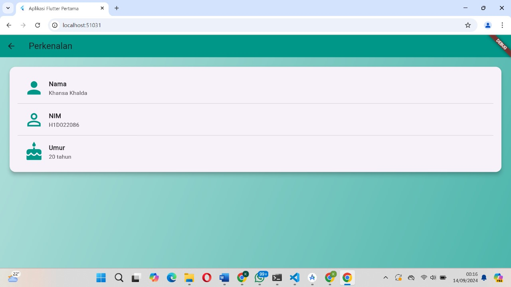

# Tugas Pertemuan 2

Proses passing data dari form ke tampilan hasil melibatkan beberapa tahap:

1. Mengambil Data dari Form: Pada halaman form_data.dart, input pengguna diambil dari widget TextField menggunakan TextEditingController.
2. Navigasi ke Halaman Hasil: Setelah pengguna menekan tombol Simpan, aplikasi akan melakukan navigasi ke halaman hasil (tampil_data.dart) dengan mempassing data input melalui konstruktor class TampilData.
3. Menampilkan Data: Pada halaman tampil_data.dart, data yang dipassing akan diterima melalui parameter konstruktor dan ditampilkan ke layar dalam bentuk widget yang rapi dan informatif.

Nama : Khansa Khalda
NIM : H1D022086
Shift Baru: A

## Screenshot

